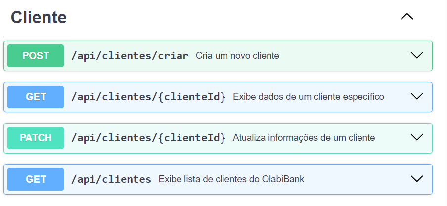
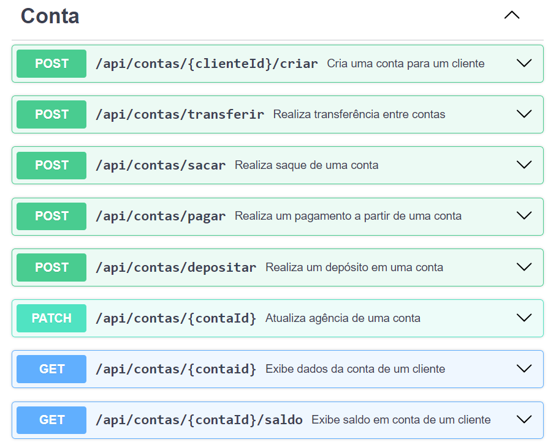

# OlabiBank Project

## Descrição

OlabiBank é um sistema bancário simples, desenvolvido para gerenciar clientes e suas contas bancárias. Este projeto inclui funcionalidades para criar clientes, criar contas, realizar depósitos, saques, transferências e pagamentos, além de permitir a atualização dos dados dos clientes e das contas.

## Funcionalidades

- **Clientes:**
    - Criar novo cliente.
    - Atualizar informações do cliente (exceto CPF).
    - Exibir lista de cliente do OlabiBank.
    - Buscar um cliente específico.
- **Contas:**
    - Criar conta para um cliente.
    - Realizar depósitos.
    - Realizar saques (4 saques mensais gratuitos, a partir do 5º saque, cobrança de R$ 6,50).
    - Realizar transferências entre contas.
    - Realizar pagamentos.
    - Listar todas as contas cadastradas no olabiBank.
    - Buscar por uma conta específica.
    - Atualizar informações de conta.

## Tecnologias Utilizadas

- 
- 
- 
- 
- 
- 

## Dependências
As principais dependências do projeto incluem:

- Spring Boot Starter Data JPA
- Spring Boot Starter Web
- PostgreSQL Driver
- Hibernate

## Endpoints da API

A documentação da API está localizada no seguinte caminho no repositório:

📂 `src`
&nbsp;&nbsp;&nbsp;&nbsp;📂 `main`
&nbsp;&nbsp;&nbsp;&nbsp;&nbsp;&nbsp;&nbsp;&nbsp;📂 `resources`
&nbsp;&nbsp;&nbsp;&nbsp;&nbsp;&nbsp;&nbsp;&nbsp;&nbsp;&nbsp;&nbsp;&nbsp;📄 `api-swagger-documentation.yaml`

*Para melhor visualização copie o arquivo e use no: [editor.swagger.io](https://editor.swagger.io/)*

### Clientes

### Conta

## Como Testar API

### Pré-requisitos

- 
- 
-  (*ou outra IDE de sua preferência*)

### Testar online
Para testar a API publicada, acesse [aqui](http://ec2-51-201-228-90.compute-1.amazonaws.com:8080/swagger-ui/index.html#/).
### Teste Local

1. **Clonar o repositório;**

2. **Configurar o banco de dados;**
   O projeto está usando PostgreSQL. A configuração do banco de dados pode ser alterada no `application.properties`

3. **Compilar e executar a aplicação;**
   - Executar maven clean e install
   - Rodar a aplicação

4. **Testar endpoints:**
    - Importar collection no postman/insomnia.
[Collection_OlabiBank_Insomnia](..%2FCollection_OlabiBank_Insomnia)

